# Jarkom_Modul4_Lapres_A03

## Soal VLSM


pada teknik VLSM, subnet mask (netmask) akan diberikan sesuai dengan kebutuhan jumlah alamat IP dari subnet tersebut.
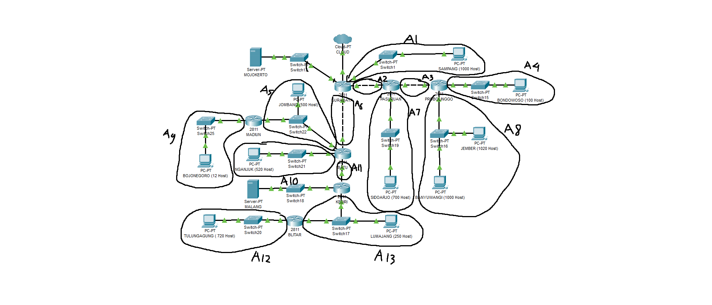

Menentukan jumlah alamat IP yang dibutuhkan oleh tiap subnet dan melakukan labelling netmask berdasarkan jumlah IP yang dibutuhkan.
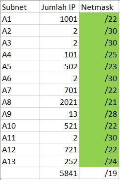
Berdasarkan total IP dan netmask yang dibutuhkan, maka kita dapat menggunakan netmask /19 untuk memberikan pengalamatan IP pada subnet.

Subnet besar yang dibentuk memiliki NID 192.168.0.0 dengan netmask /19. Selanjutnya, menghitung pembagian IP berdasarkan NID dan netmask tersebut menggunakan pohon serta melakukan subnetting dengan menggunakan pohon tersebut untuk pembagian IP sesuai dengan kebutuhan masing-masing subnet yang ada.
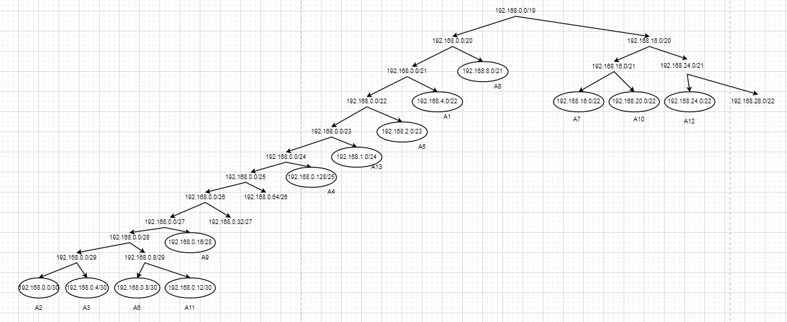


## Soal CIDR

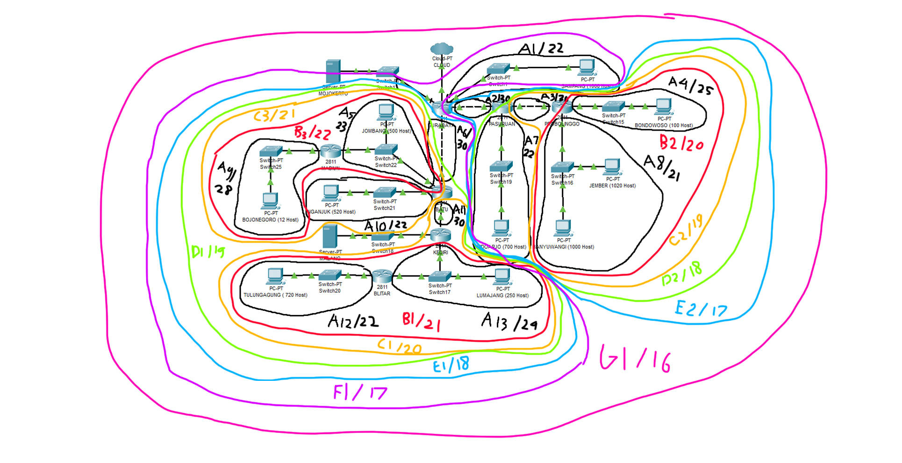

Cara perhitungan dengan metode CIDR adalah menggabungkan 2 subnet yang 1 level yang terjauh daripada router utama yaitu surabaya, jadi kita bisa gabungkan dengan cara berikut:

- Subnet A12 dan A13 digabungkan menjadi subnet B1 dengan mask /21
- Subnet A4 dan A8 digabungkan menjadi subnet B2 dengan mask /20
- Subnet A9 dan A5 digabungkan menjadi subnet B3 dengan mask /22
- Subnet B1 dan A11 digabungkan menjadi subnet C1 dengan mask /20
- Subnet B2 dan A3 digabungkan menjadi subnet C2 dengan mask /19
- Subnet B3 dan A10 digabungkan menjadi subnet C3 dengan mask /21
- Subnet C1 dan C3 digabungkan menjadi subnet D1 dengan mask /19
- Subnet C2 dan A7 digabungkan menjadi subnet D2 dengan mask /18
- Subnet D1 dan A6 digabungkan menjadi subnet E1 dengan mask /18
- Subnet D2 dan A2 digabungkan menjadi subnet E2 dengan mask /17
- Subnet E1 dan A1 digabungkan menjadi subnet F1 dengan mask /17
- Subnet F1 dan E2 digabungkan menjadi subnet G1 dengan mask /16

Setelah itu kita bisa buat tree dari penggabungan diatas, maka treenya akan menjadi seperti berikut

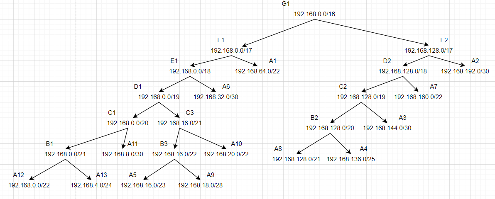

Karena CIDR digunakan pada UML, maka kita akan buat topologinya untuk setting UML nya, yaitu seperti berikut:

```
# Switch
uml_switch -unix switch0 > /dev/null < /dev/null &
uml_switch -unix switch1 > /dev/null < /dev/null &
uml_switch -unix switch2 > /dev/null < /dev/null &
uml_switch -unix switch3 > /dev/null < /dev/null &
uml_switch -unix switch4 > /dev/null < /dev/null &
uml_switch -unix switch5 > /dev/null < /dev/null &
uml_switch -unix switch6 > /dev/null < /dev/null &
uml_switch -unix switch7 > /dev/null < /dev/null &
uml_switch -unix switch8 > /dev/null < /dev/null &
uml_switch -unix switch9 > /dev/null < /dev/null &
uml_switch -unix switch10 > /dev/null < /dev/null &
uml_switch -unix switch11 > /dev/null < /dev/null &
uml_switch -unix switch12 > /dev/null < /dev/null &
uml_switch -unix switch13 > /dev/null < /dev/null &
uml_switch -unix switch14 > /dev/null < /dev/null &
uml_switch -unix switch15 > /dev/null < /dev/null &

# Router
xterm -T SURABAYA -e linux ubd0=SURABAYA,jarkom umid=SURABAYA eth0=tuntap,,,'10.151.72.17' eth1=daemon,,,switch1 eth2=daemon,,,switch2 eth3=daemon,,,switch7 eth4=daemon,,,switch0 mem=64M &
xterm -T PASURUAN -e linux ubd0=PASURUAN,jarkom umid=PASURUAN eth0=daemon,,,switch2 eth1=daemon,,,switch3 eth2=daemon,,,switch8 mem=64M &
xterm -T PROBOLINGGO -e linux ubd0=PROBOLINGGO,jarkom umid=PROBOLINGGO eth0=daemon,,,switch3 eth1=daemon,,,switch4 eth2=daemon,,,switch9 mem=64M &
xterm -T BATU -e linux ubd0=BATU,jarkom umid=BATU eth0=daemon,,,switch7 eth1=daemon,,,switch11 eth2=daemon,,,switch10 eth3=daemon,,,switch6 mem=64M &
xterm -T MADIUN -e linux ubd0=MADIUN,jarkom umid=MADIUN eth0=daemon,,,switch6 eth1=daemon,,,switch5 mem=64M &
xterm -T KEDIRI -e linux ubd0=KEDIRI,jarkom umid=KEDIRI eth0=daemon,,,switch11 eth1=daemon,,,switch14 eth2=daemon,,,switch12 mem=64M &
xterm -T BLITAR -e linux ubd0=BLITAR,jarkom umid=BLITAR eth0=daemon,,,switch14 eth1=daemon,,,switch13 mem=64M &

# Server
xterm -T MALANG -e linux ubd0=MALANG,jarkom umid=MALANG eth0=daemon,,,switch12 mem=64M &
xterm -T MOJOKERTO -e linux ubd0=MOJOKERTO,jarkom umid=MOJOKERTO eth0=daemon,,,switch0 mem=64M &

# Klien
xterm -T SAMPANG -e linux ubd0=SAMPANG,jarkom umid=SAMPANG eth0=daemon,,,switch1 mem=64M &
xterm -T BONDOWOSO -e linux ubd0=BONDOWOSO,jarkom umid=BONDOWOSO eth0=daemon,,,switch4 mem=64M &
xterm -T JEMBER -e linux ubd0=JEMBER,jarkom umid=JEMBER eth0=daemon,,,switch9 mem=64M &
xterm -T SIDOARJO -e linux ubd0=SIDOARJO,jarkom umid=SIDOARJO eth0=daemon,,,switch8 mem=64M &
xterm -T BANYUWANGI -e linux ubd0=BANYUWANGI,jarkom umid=BANYUWANGI eth0=daemon,,,switch9 mem=64M &
xterm -T JOMBANG -e linux ubd0=JOMBANG,jarkom umid=JOMBANG eth0=daemon,,,switch6 mem=64M &
xterm -T BOJONEGORO -e linux ubd0=BOJONEGORO,jarkom umid=BOJONEGORO eth0=daemon,,,switch5 mem=64M &
xterm -T NGANJUK -e linux ubd0=NGANJUK,jarkom umid=NGANJUK eth0=daemon,,,switch10 mem=64M &
xterm -T LUMAJANG -e linux ubd0=LUMAJANG,jarkom umid=LUMAJANG eth0=daemon,,,switch14 mem=64M &
xterm -T TULUNGAGUNG -e linux ubd0=TULUNGAGUNG,jarkom umid=TULUNGAGUNG eth0=daemon,,,switch13 mem=64M &
```

Untuk mengatur interface pada setiap uml, kita bisa menjalankan command `nano /etc/networking/interface` untuk mengedit file nya lalu tambahkan sesuai dengan konfigurasi dibawah ini:

```
SURABAYA
--------------------------------------
auto eth0
iface eth0 inet static
address 10.151.72.18
netmask 255.255.255.252
gateway 10.151.72.17

auto eth1
iface eth1 inet static
address 192.168.64.1
netmask 255.255.252.0

auto eth2
iface eth2 inet static
address 192.168.192.1
netmask 255.255.255.252

auto eth3
iface eth3 inet static
address 192.168.32.1
netmask 255.255.255.252

auto eth4
iface eth4 inet static
address 10.151.73.33
netmask 255.255.255.252


PASURUAN
----------------------------------------------
auto eth0
iface eth0 inet static
address 192.168.192.2
netmask 255.255.255.252
gateway 192.168.192.1

auto eth1
iface eth1 inet static
address 192.168.144.1
netmask 255.255.255.252

auto eth2
iface eth2 inet static
address 192.168.160.1
netmask 255.255.252.0

PROBOLINGGO
---------------------------------------------
auto eth0
iface eth0 inet static
address 192.168.144.2
netmask 255.255.255.252
gateway 192.168.144.1

auto eth1
iface eth1 inet static
address 192.168.136.1
netmask 255.255.255.128

auto eth2
iface eth2 inet static
address 192.168.128.1
netmask 255.255.248.0

BATU
----------------------------------------------
auto eth0
iface eth0 inet static
address 192.168.32.2
netmask 255.255.255.252
gateway 192.168.32.1

auto eth1
iface eth1 inet static
address 192.168.8.1
netmask 255.255.255.252

auto eth2
iface eth2 inet static
address 192.168.20.1
netmask 255.255.252.0

auto eth3
iface eth3 inet static
address 192.168.16.1
netmask 255.255.254.0

MADIUN
----------------------------------------
auto eth0
iface eth0 inet static
address 192.168.16.2
netmask 255.255.254.0
gateway 192.168.16.1

auto eth1
iface eth1 inet static
address 192.168.18.1
netmask 255.255.255.240

KEDIRI
------------------------------------------
auto eth0
iface eth0 inet static
address 192.168.8.2
netmask 255.255.255.252
gateway 192.168.8.1

auto eth1
iface eth1 inet static
address 192.168.4.1
netmask 255.255.255.0

auto eth2
iface eth2 inet static
address 10.151.73.37
netmask 255.255.255.252

BLITAR
---------------------------------------
auto eth0
iface eth0 inet static
address 192.168.4.2
netmask 255.255.255.0
gateway 192.168.4.1

auto eth1
iface eth1 inet static
address 192.168.0.1
netmask 255.255.252.0


MOJOKERTO
---------------------------------------
auto eth0
iface eth0 inet static
address 10.151.73.34
netmask 255.255.255.252
gateway 10.151.73.33

MALANG
---------------------------------------
auto eth0
iface eth0 inet static
address 10.151.73.38
netmask 255.255.255.252
gateway 10.151.73.37


SAMPANG
---------------------------------------
auto eth0
iface eth0 inet static
address 192.168.64.2
netmask 255.255.252.0
gateway 192.168.64.1

BONDOWOSO
---------------------------------------
auto eth0
iface eth0 inet static
address 192.168.136.2
netmask 255.255.255.128
gateway 192.168.136.1

JEMBER
---------------------------------------
auto eth0
iface eth0 inet static
address 192.168.128.2
netmask 255.255.248.0
gateway 192.168.128.1

BANYUWANGI
---------------------------------------
auto eth0
iface eth0 inet static
address 192.168.128.3
netmask 255.255.248.0
gateway 192.168.128.1

SIDOARJO
----------------------------------------
auto eth0
iface eth0 inet static
address 192.168.160.2
netmask 255.255.252.0
gateway 192.168.160.1

JOMBANG
----------------------------------------
auto eth0
iface eth0 inet static
address 192.168.16.3
netmask 255.255.254.0
gateway 192.168.16.1

BOJONEGORO
-----------------------------------------
auto eth0
iface eth0 inet static
address 192.168.18.2
netmask 255.255.255.240
gateway 192.168.18.1

NGANJUK
-------------------------------------------
auto eth0
iface eth0 inet static
address 192.168.20.2
netmask 255.255.252.0
gateway 192.168.20.1

LUMAJANG
-------------------------------------------
auto eth0
iface eth0 inet static
address 192.168.4.3
netmask 255.255.255.0
gateway 192.168.4.1

TULUNGAGUNG
-------------------------------------------
auto eth0
iface eth0 inet static
address 192.168.0.2
netmask 255.255.252.0
gateway 192.168.0.1
```

Setelah itu, lakukan `service networking restart` untuk mengaktifkan konfigurasi tersebut. Untuk setiap router, lakukan setting pada sysctl dengan mengedit `nano /etc/sysctl.conf` dan hilangkan comment pada `net.ipv4.ip_forward=1` dan jalankan command `sysctl -p` untuk mengaktifkannya. 

Untuk router Surabaya jalankan iptables dengan command:
```
iptables –t nat –A POSTROUTING –o eth0 –j MASQUERADE –s 192.168.0.0/16
```

Untuk routing, kita bisa lihat pada gambar perhitungan diatas, bahwa hanya 4 router yang akan disetting, yaitu Subaraya, Batu, Pasuruan, dan Kediri. Untuk Surabaya perlu dikenalkan dengan subnet D1, D2, dan server Malang. Untuk Batu, kita perlu mengenalkannya dengan subnet B1, A9, dan server Malang. Untuk Pasuruan kita perlu mengenalkannya dengan subnet B2. Untuk Kediri, kita perlu mengenalkannya dengan subnet A12. Maka dari itu, kita bisa jalankan command dibawah disetiap UML yang perlu dirouting, yaitu:

### Surabaya
```
route add -net 192.168.128.0 netmask 255.255.192.0 gw 192.168.192.2
route add -net 192.168.0.0 netmask 255.255.224.0 gw 192.168.32.2
route add -net 10.151.73.36 netmask 255.255.255.252 gw 192.168.32.2
```
### Batu
```
route add -net 10.151.73.36 netmask 255.255.255.252 gw 192.168.8.2
route add -net 192.168.0.0 netmask 255.255.248.0 gw 192.168.8.2
route add -net 192.168.18.0 netmask 255.255.255.240 gw 192.168.16.2
```
### Kediri
```
route add -net 192.168.0.0 netmask 255.255.252.0 gw 192.168.4.2
```
### Pasuruan
```
route add -net 192.168.128.0 netmask 255.255.240.0 gw 192.168.144.2
```

Untuk default routing pada UML sudah otomatis tertambahkan pada saat mengkonfigurasi interfacenya sehingga tidak perlu ditambahkan lagi disetiap router.

Untuk testing, kita dapat melakukan ping dari subnet satu ke subnet lainnya, dibawah adalah beberapa contoh dari testingnya:

#### **ping banyuwangi ke malang**
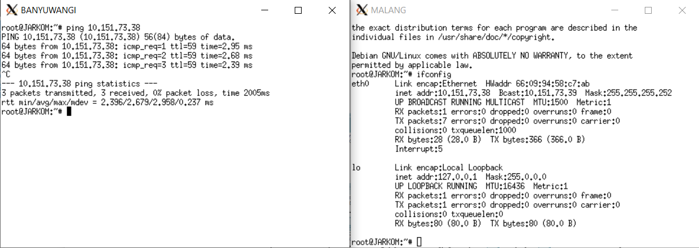

#### **ping lumajang ke bojonegoro**
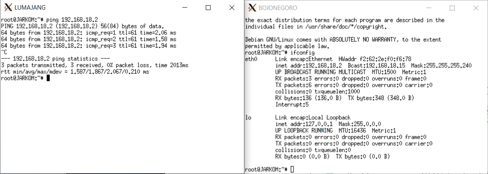

#### **ping malang ke mojokerto**
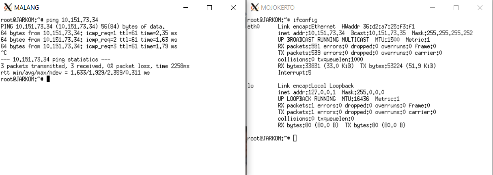

#### **ping nganjuk ke mojokerto**
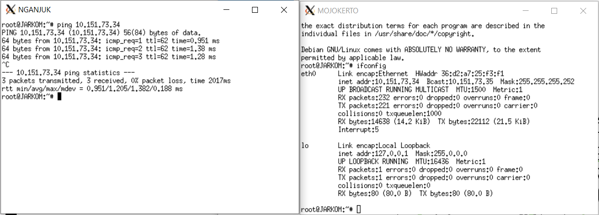

#### **ping tulungagung ke bondowoso**
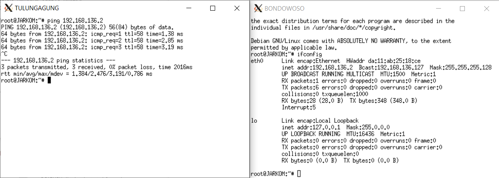

Untuk testing lainnya, kita bisa melakukan ping its.ac.id dari semua UML, contoh beberapa ping nya adalah sebagai berikut:

#### **ping its.ac.id dari banyuwangi**
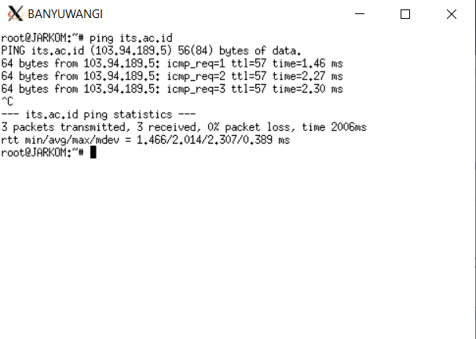

#### **ping its.ac.id dari bojonegoro**
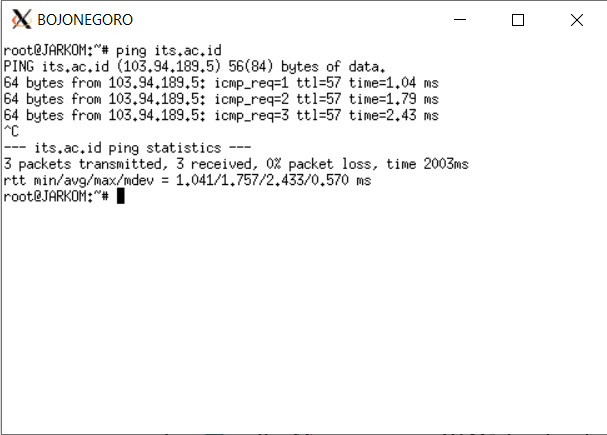

#### **ping its.ac.id dari bondowoso**
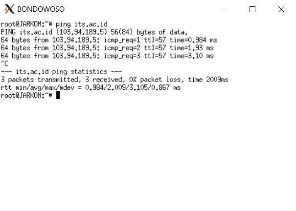

#### **ping its.ac.id dari jember**
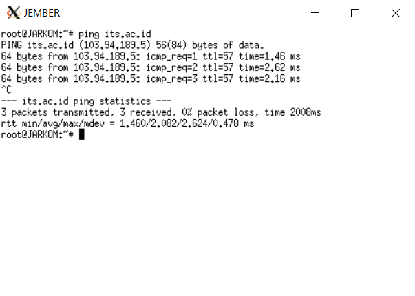

#### **ping its.ac.id dari jombang**
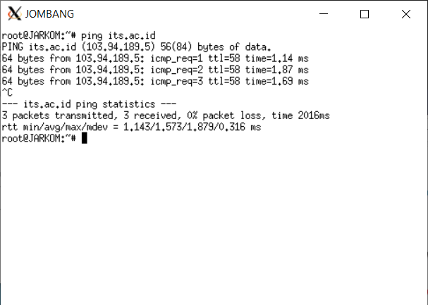

#### **ping its.ac.id dari lumajang**
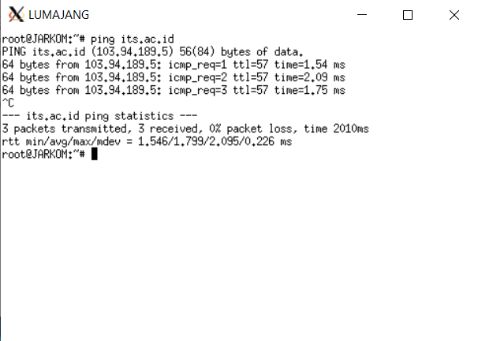

#### **ping its.ac.id dari nganjuk**
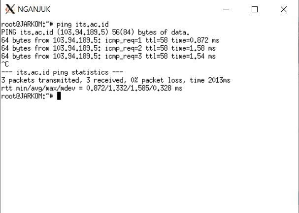

#### **ping its.ac.id dari sampang**
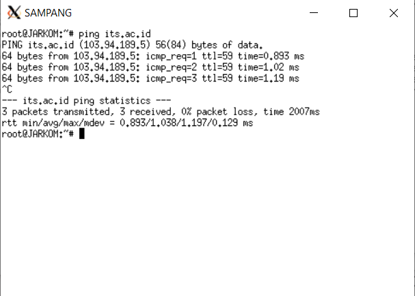

#### **ping its.ac.id dari sidoarjo**
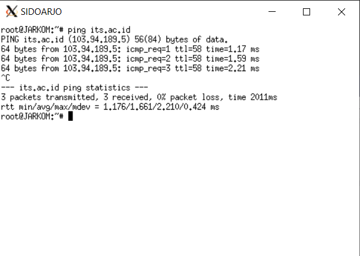

#### **ping its.ac.id dari tulungagung**
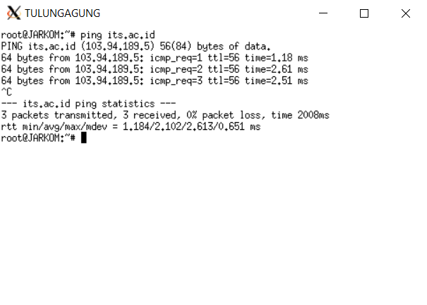
